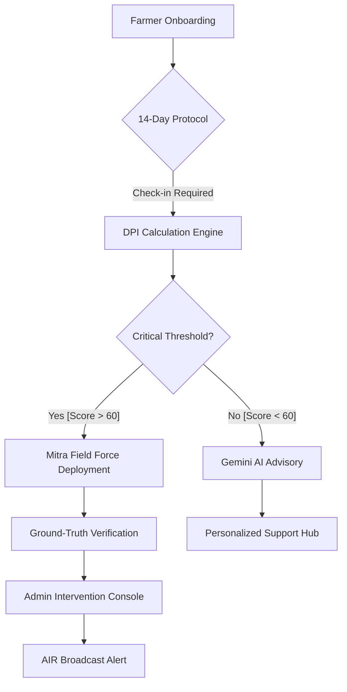
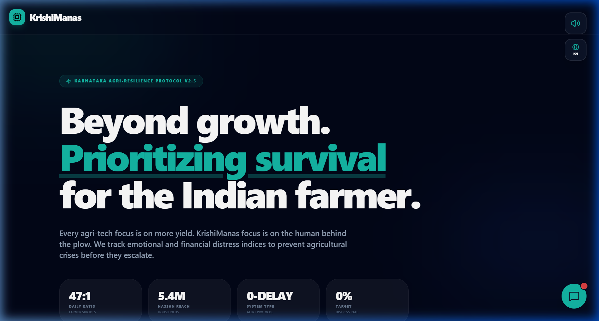
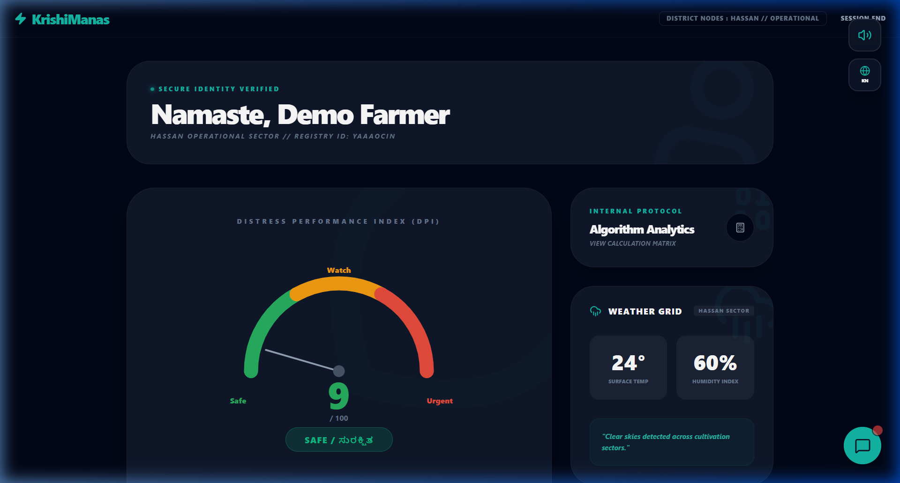
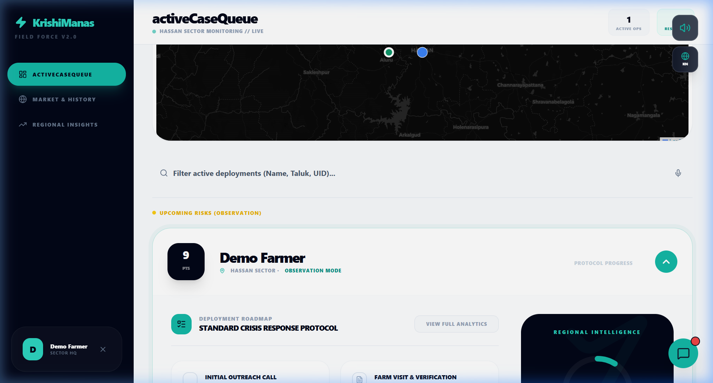
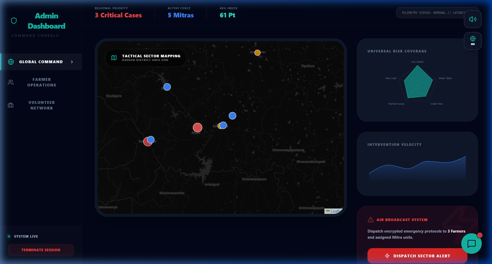
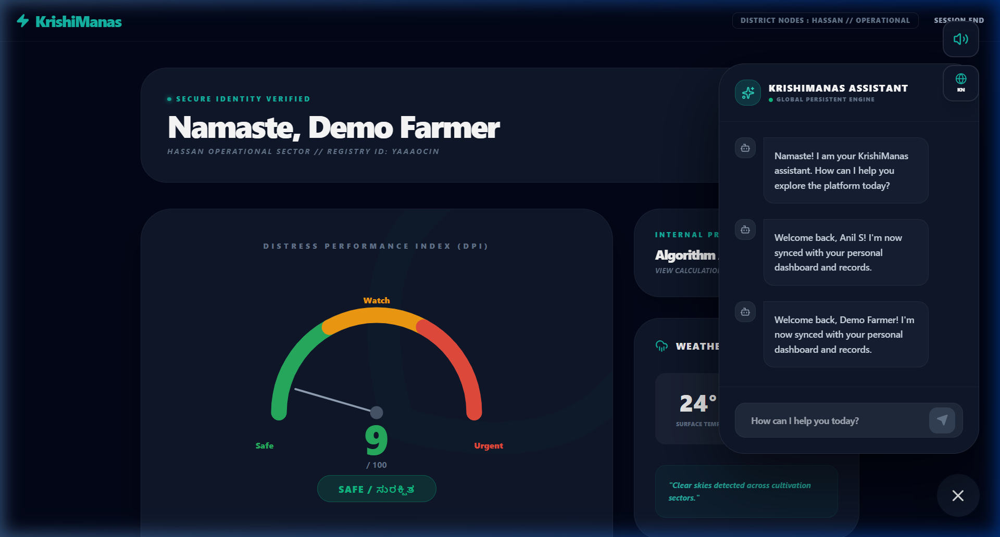
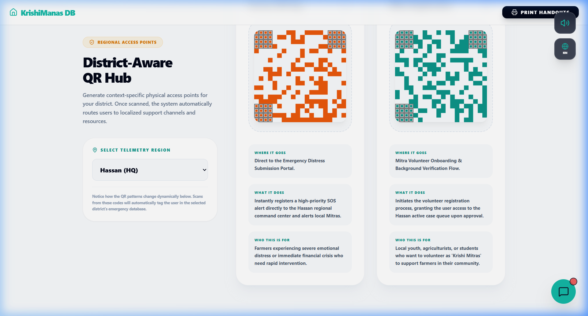

# KrishiManas (v2.5) 🌾🛡️
## "Beyond growth. Prioritizing survival for the Indian farmer."

---

## 🌩️ The Crisis
Every agri-tech focuses on a single metric: **Yield**. But while yields go up, the human behind the plow faces an unprecedented crisis of mental and financial distress. In India, agricultural distress is not a data problem—it is a **survival problem**.

## 🛡️ The Mission: KrishiManas
**KrishiManas** isn't just an app; it's a **Tactical Resilience Protocol**. We move the focus from the harvest to the heart. By calculating a real-time **Distress Performance Index (DPI)**, the system identifies psychological and economic tipping points *before* they lead to a crisis.

---

## 🗺️ System Architecture

Our platform follows a "High-Tech / High-Touch" hybrid model. We use AI to identify the signal and humans (Mitras) to deliver the solution.

---

## 📸 Operational Breakdown

### 🛰️ Farmer Entry & Onboarding
A multi-phase protocol that maps the farmer's regional unit (Hassan, Aluru, etc.) and establishes a secure identity index.

### 📊 The Farmer Console
The central hub for the **14-Day Diagnostic Protocol**. Farmers monitor their DPI gauge, access hyper-local weather alerts, and review their eligibility map for government schemes.

### 🤝 The Mitra Field Force (Human-in-the-loop)
Volunteers (Mitras) act as the physical extension of the digital platform. They manage a `CriticalCaseQueue`, track protocol roadmaps, and log physical farm visits to ensure no record goes unverified.

### 🗺️ Admin Tactical Hub
A regional "God'view" maps distress hotspots across taluks. Admins can trigger the **AIR Broadcast System** to send encrypted emergency protocols to specific sectors in under 60ms.

### 🧠 Gemini-Powered Intelligence
**Google Gemini 1.5 Flash** acts as the platform's brain, providing bilingual (Kannada/English) support and matching farmers with schemes like PM-Kisan based on their specific DPI profile.

### 📲 District-Aware QR Hub
Contextual distribution center for localized access points. QR patterns change dynamically based on the telemetry region to map scans to the correct district HQ.

---

## 🛠️ Technology Stack

| Layer | Technology |
| :--- | :--- |
| **Frontend UI** | [React 19](https://react.dev/) + [Vite](https://vitejs.dev/) + [Tailwind CSS](https://tailwindcss.com/) |
| **Animation** | [Framer Motion](https://www.framer.com/motion/) (Cinematic transitions & inertia) |
| **Mapping** | [Leaflet.js](https://leafletjs.com/) (Tactical regional mapping) |
| **Database** | [Firestore](https://firebase.google.com/docs/firestore) (Real-time telemetry) |
| **Intelligence** | [Google Gemini 1.5 Flash API](https://deepmind.google/technologies/gemini/) (Generative Advisory) |
| **Backend** | [Node.js](https://nodejs.org/) + [Express](https://expressjs.com/) |

---

## 🚀 Vision V3.0 (Roadmap)
- [ ] **Predictive Edge**: Anticipating distress via IoT soil & weather sensors before the farmer reports it.
- [ ] **WhatsApp HQ**: Integrating the full Mitra protocol into a headless WhatsApp bot for 100% offline reach.
- [ ] **Regional Scale**: Expanding from Hassan District to the entire Karnataka state map.

---

## ⚡ Deployment

### Prerequisites
- Node.js v18+
- Firebase Admin SDK
- Google AI Studio API Key

### Installation
1. Clone: `git clone https://github.com/lolaamh06/KrishiManas-Core.git`
2. Frontend: `cd frontend && npm install && npm run dev`
3. Backend: `cd backend && npm install && node index.js`

---

## 🤝 Project Lead
Developed and Architected by **[Lolaa M H](https://github.com/lolaamh06)**.

*For the Indian Farmer. Made with heart and high-fidelity code.*
